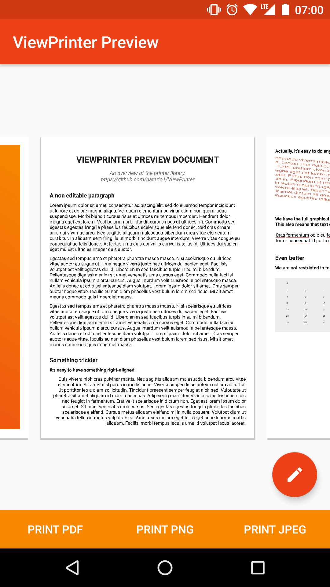
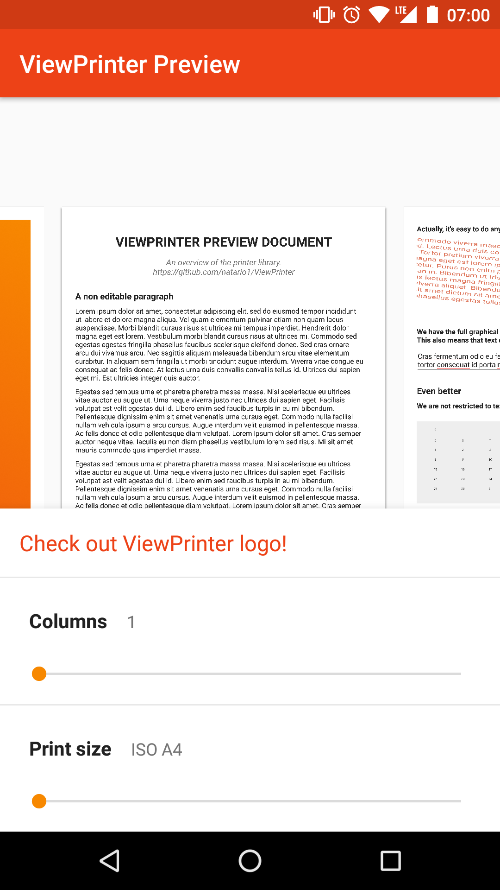
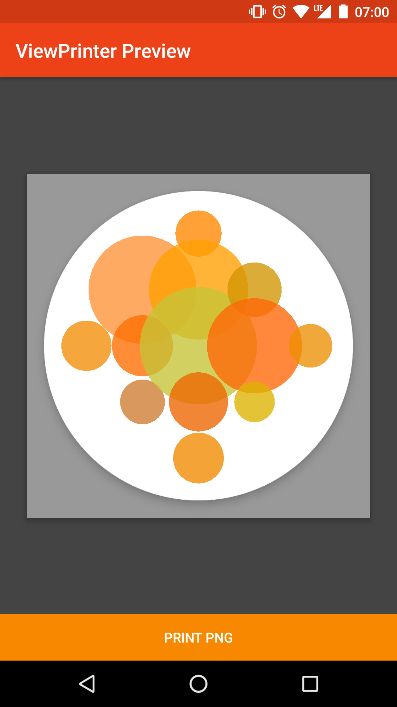

[](https://travis-ci.org/natario1/ViewPrinter)

<p align="center">
  
</p>

*The ViewPrinter logo was created inside ViewPrinter itself, with a few minutes and some Canvas drawing.
It's a FloatingActionButton with circles on it, then exported to PNG. See source code in the demo app.*

# ViewPrinter

ViewPrinter lets you preview, edit and print View hierarchies, be it graphics, texts, 
or whatever you can draw in Android.

```groovy
compile 'com.otaliastudios:viewprinter:0.2.0'
```

<p>
  
  
  
</p>

## Features

- [`DocumentView`](#documentview) : a live preview container for editable, zoomable, pannable views.
- Automatic splitting into separate pages
- Automatic splitting into separate page columns
- Standardized or custom [`PrintSize`](#printsize)s, or even wrap content
- [`PdfPrinter`](#pdfprinter) prints document to PDF respecting pages
- [`JpegPrinter`](#jpegprinter) and [`PngPrinter`](#pngprinter) to print single pages
- Lightweight as possible, depends only on [natario1/ZoomLayout](https://github.com/natario1/ZoomLayout)

# Docs

- [Why](#why)
- [DocumentView](#documentView)
  - [Unbounded content](#unbounded-content)
  - [Bounded content](#bounded-content)
  - [Automatic Splitting](#automatic-splitting)
  - [Callbacks](#callbacks)
- [PrintSize and Units](#printsize-and-units)  
- [Printing documents](#printing-documents)
  - [Permissions](#permissions)
  - [PdfPrinter](#pdfprinter)
  - [PngPrinter](#pngprinter)
  - [JpegPrinter](#jpegprinter)

## Why

The starting point of this library is that the Android framework is extremely powerful and versatile when drawing.
Android is not a complete word processor, and is not a complete graphic editor. But it is a decent mix between the two,
and with a few Android drawing skills - even just layout - we can draw objects, construct hierarchies,
create complex layouts with dependencies, apply transformations and whatever else we usually do.

This can be an incomplete, but very powerful and versatile tool for document creation, whether its text,
your resume, or a graphical task. The only things lacking, in order to leverage this versatility, are:

- a decent document preview editor
- an easy way to print the document

This library provides both.

## DocumentView

```xml
<com.otaliastudios.printer.DocumentView
    android:layout_width="match_parent"
    android:layout_height="match_parent"
    app:pageElevation="0.01in"
    app:pageInsetTop="20pt"
    app:pageInsetBottom="20pt"
    app:pageInsetLeft="30pt"
    app:pageInsetRight="30pt"
    app:pageDividerWidth="0.1in"
    app:columnsPerPage="1"
    app:pageBackground="@color/white"
    app:pagerType="horizontal"
    app:printSize="ISO_A5">

    <!-- Content here. -->

</com.otaliastudios.printer.DocumentView>
```

`DocumentView` offers a live, zoom-and-pannable preview of your View content.
It is actually an instance of [`ZoomLayout`](https://github.com/natario1/ZoomLayout) so
head there to discover more visual APIs.

`DocumentView` can host any kind and number of Android views. Internally, they are laid
out into pages (or columns) that act as a vertical `LinearLayout`, so keep that in mind
when adding childs.

### Unbounded content

The document view can act as if it had no physical boundaries. This can be achieved
by setting the `PrintSize` to `PrintSize.WRAP_CONTENT`, which is a special size designed
for this.

In this case, the content can extend to whatever dimensions you want, and the printed
output file will follow.

```xml
<com.otaliastudios.printer.DocumentView
    android:layout_width="match_parent"
    android:layout_height="match_parent"
    app:printSize="wrapContent">

    <!-- Allowed -->
    <View
        android:layout_width="5000px"
        android:layout_height="5000px"/>

</com.otaliastudios.printer.DocumentView>
```

If your content changes, the page will adapt to it.

### Bounded content

Typically you would like to define the output file size (be it PDF or PNG or whatever).
It can be achieved through `app:printSize` or `view.setPrintSize(PrintSize)`, and
by doing this you are implicitly setting a boundary for the page content.

Your page(s) will be laid out as having that dimension. Keep this in mind when adding
your child views:

```xml
<com.otaliastudios.printer.DocumentView
    android:layout_width="match_parent"
    android:layout_height="match_parent"
    app:printSize="ISO_A5">

    <!-- MATCH_PARENT on both: this view will occupy a whole page/column! -->
    <View
        android:layout_width="match_parent"
        android:layout_height="match_parent"/>
        
    <!-- MATCH_PARENT on width: this view will fit the page/column width and extend to its height.
         If it happens to be bigger than the page, part of it will be hidden (there's nothing we 
         can do) -->
    <View
        android:layout_width="match_parent"
        android:layout_height="wrap_content"/>
        
    <!-- WRAP_CONTENT: nothing special, the view wraps content, bounded by the page. -->
    <View
        android:layout_width="wrap_content"
        android:layout_height="wrap_content"/>
    
</com.otaliastudios.printer.DocumentView>
```

### Automatic Splitting

The document preview will automatically split the content into different pages, and,
if enabled, different vertical columns of a single page. This is managed by simply
listening to layout changes.

A few notes:

- For text, please use `DocumentTextView`: it will notify the parent when it gets bigger.
- For editable text, please use `DocumentEditText`: same as above.
- If using app compat, you might want to use the `AppCompat-` version of these widgets.
- We can't split text of a single view into multiple pages or columns (for now).
  It is your responsibility to have Views that are small enough to avoid blank spaces.
- For custom views, take a look at `DocumentHelper` methods.

To enable columns, use `document.setColumnsPerPage(int)` or the XML attribute `app:columnsPerPage`.

### Callbacks

You can be notified of pages creation or destruction by simply setting a `DocumentCallback`:

```java
document.setDocumentCallback(new DocumentCallback() {
    @Override
    public void onPageCreated(int number) {}
    
    @Override
    public void onPageDestroyed(int number) {}
})
```

## PrintSize and Units

The `PrintSize` object is what links the live preview of `DocumentView` to the printers,
defining the actual size of each page.

The `PrintSize` class offers lots of predefined, standardized sizes that you can use for printing
your documents, or a special `WRAP_CONTENT` size that is suitable for one-page content.

You can also define a custom `PrintSize` of your choice, using the static methods:

- `PrintSize.fromMils(int, int)`: sets the content size in *mils*, that is, thousandth-s of an inch.
- `PrintSize.fromPoints(float, float)`: sets the content size in *points*, that is, 72th-s of an inch.
- `PrintSize.fromInches(float, float)`: sets the content size in *inches*.
- `PrintSize.fromMillimeters(int, int)`: sets the content size in *millimeters*.
- `PrintSize.fromPixels(Context, float, float)`: sets the content size in *pixels*. We need a valid context to know the display metrics.

There is no preferable API - it's up to your content and how you want to deal with it.
These units must be considered in XML also when laying out your views, for example:

```xml
android:layout_width="20pt"
android:layout_width="2in"
android:layout_width="2px"
android:textSize="20px"
app:pageInsets="30mm"
```

Depending on what you do, standard units like `sp` and `dp` *might* make no sense here.

## Printing documents

The printing process is extremely simple, and currently requires a non empty `DocumentView` preview
to work. Once you have added your content, simply call the `print(String, File, String)`
method of the printer of your choice. You must pass:

- `String printId`: an identifier for this printing process
- `File file`: a directory where the file will be written
- `String name`: the filename of the output file

The printing action will be executed in a background thread, and you will receive a successful
`PrintCallback` callback on the UI thread once it ended, so you can display your file.

### Permissions

You must have appropriate permissions to write the file in that location.
On Marshmallow+, these permissions must be explicitly asked to the user.

The library currently will automatically ask the `READ_EXTERNAL_STORAGE` and `WRITE_EXTERNAL_STORAGE`
permissions if the output file appears to be in the external storage. Make sure you

- declare these permissions in your manifest
- implement `onRequestPermissionResult` as such:

```java
@Override
public void onRequestPermissionsResult(int requestCode, @NonNull String[] permissions, @NonNull int[] grantResults) {
    super.onRequestPermissionsResult(requestCode, permissions, grantResults);
    if (mPrinter.onRequestPermissionRequest(requestCode, permissions, grantResults)) {
        mPrinter.print(mId, mDirectory, mFilename);
    }
}
```

### PdfPrinter

```java
mPrinter = new PdfPrinter(mDocumentView, mPrintCallback);
mPrinter.setPrintPageBackground(true);
mPrinter.print("id", mFile, "document.pdf");
```

Nothing special. This will create a document with your exact name in the directory, as long as you 
have rights to write there. The output PDF will have as much pages as your live preview.

You can choose whether to include or exclude the page background using `mPrinter.setPrintPageBackground()`
which defaults to `true`.

### PngPrinter

```java
mPrinter = new PngPrinter(mDocumentView, mPrintCallback);
mPrinter.setPrintPageBackground(true);
mPrinter.setPrintPages(PRINT_ALL);
mPrinter.setPrintScale(1f);
mPrinter.print("id", mFile, "my-image");
```

Image printers have a couple differences with the `PdfPrinter`:

- You can choose which pages to print (defaults to all) using `setPrintPages(int...)`.
  If more than one are selected, we will save separate files in your directory, e.g.
  `my-image-1.png`, `my-image-2.png`, `my-image-3.png`.

- This also means that the `PrintCallback` can be called multiple times, each time passing
  the actual image file.
  
- You can downscale the resulting image using `setPrintScale(float)`, defaults to 1. For instance,
  this is useful for caching low-quality previews. A `1000x1000` image with a `0.5` scale will
  result in a `500x500` file.

### JpegPrinter

```java
mPrinter = new JpegPrinter(mDocumentView, mPrintCallback);
mPrinter.setPrintPageBackground(true);
mPrinter.setPrintablePages(PRINT_ALL);
mPrinter.setPrintScale(1f);
mPrinter.setPrintQuality(90);
mPrinter.print("id", mFile, "my-image");
```

On top of the `PngPrinter` functionality, this will let you specify a JPEG compression quality
using `mPrinter.setPrintQuality()`.

# Contributions

You are welcome to contribute with suggestions or pull requests.
